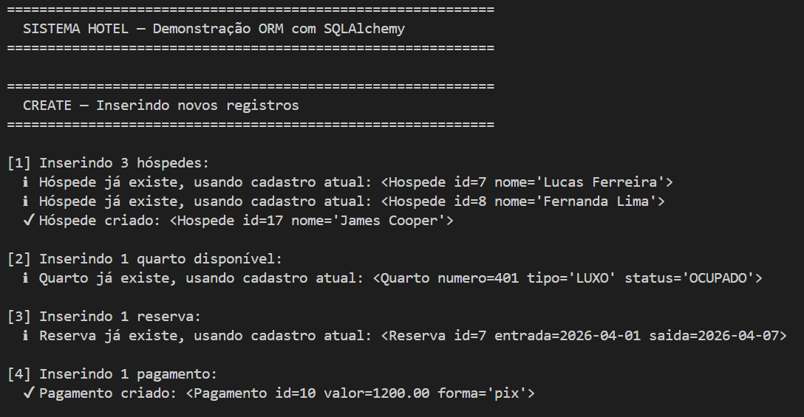
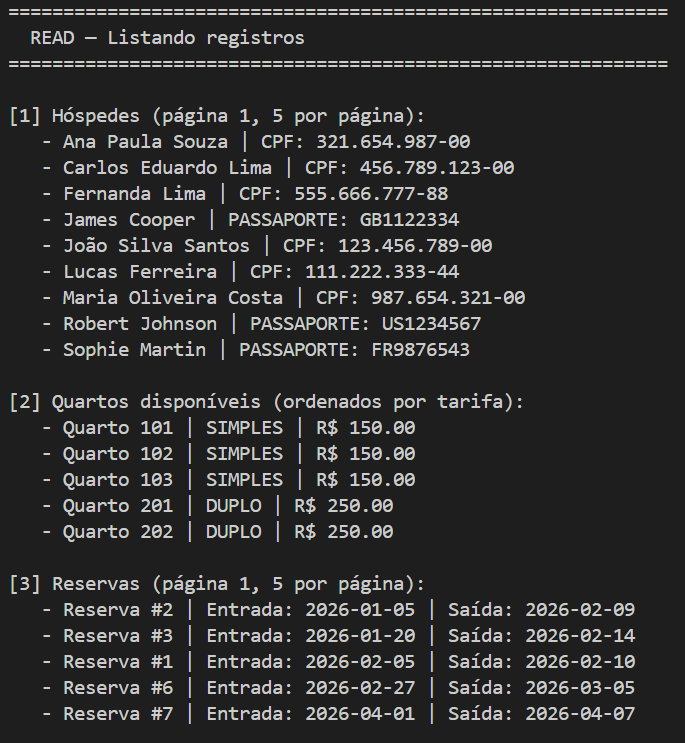
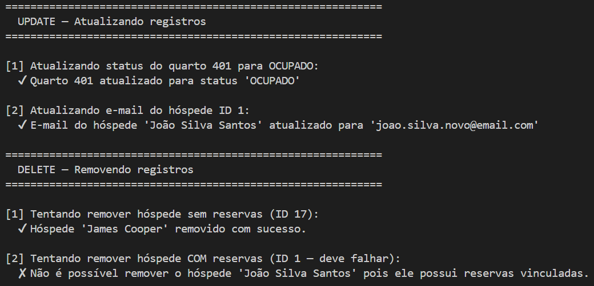
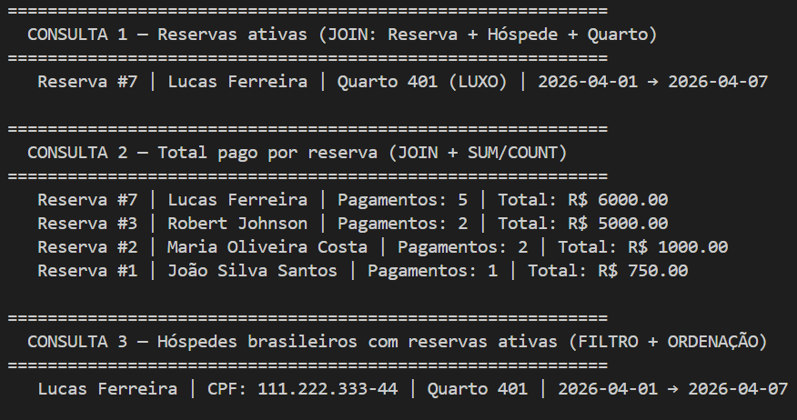
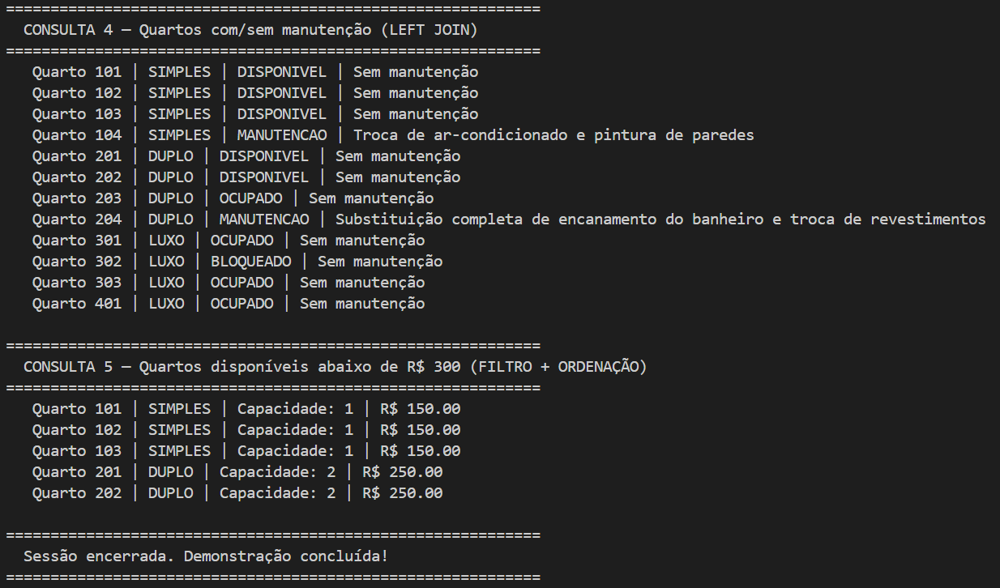

# Hotel ORM — SQLAlchemy + PostgreSQL

Projeto Python que conecta ao banco `sistema_hotel` usando SQLAlchemy como ORM.

---

## Estrutura do projeto

```
hotel_orm/
├── database.py          # Conexão com o PostgreSQL
├── main.py              # Ponto de entrada (executa tudo)
├── requirements.txt     # Dependências
├── models/
│   └── models.py        # Mapeamento ORM das tabelas
├── crud/
│   └── crud.py          # Operações CREATE, READ, UPDATE, DELETE
└── queries/
    └── queries.py       # Consultas com JOIN, filtro e agregação
```

---

## Pré-requisitos

- Python 3.10 ou superior
- PostgreSQL com o banco `sistema_hotel` criado e populado (Script.sql)

---

## Instalação

### 1. Instale as dependências

Abra o terminal (CMD ou PowerShell) na pasta `projetoBancoDados` e execute:

```bash
pip install -r requirements.txt
```

### 2. Configure a senha no `database.py`

Abra o arquivo `database.py` e edite a linha:

```python
DB_PASSWORD = "1234"   # <- coloque sua senha do PostgreSQL aqui
```

---

## Executando

Na pasta `projetoBancoDados`, execute:

```bash
python main.py
```

---

## O que o projeto demonstra

### Mapeamento ORM (models/models.py)
| Classe         | Tabela              | Relacionamentos                     |
|----------------|---------------------|--------------------------------------|
| `Hospede`      | hospede             | 1-N com Reserva                      |
| `Quarto`       | quarto              | 1-N com Reserva, 1-N com Manutencao  |
| `QuartoManutencao` | quarto_manutencao | N-1 com Quarto                   |
| `Reserva`      | reserva             | N-1 com Hospede, N-1 com Quarto, 1-N com Pagamento |
| `Pagamento`    | pagamento           | N-1 com Reserva                      |

### CRUD (crud/crud.py)
- **CREATE**: insere hóspedes, quartos, reservas e pagamentos
- **READ**: lista com paginação e ordenação
- **UPDATE**: atualiza status do quarto e e-mail do hóspede
- **DELETE**: remove com verificação de integridade referencial

### Consultas com relacionamento (queries/queries.py)
| # | Descrição                                          | Técnica           |
|---|----------------------------------------------------|-------------------|
| 1 | Reservas ativas com hóspede e quarto               | JOIN              |
| 2 | Total pago por reserva                             | JOIN + SUM/COUNT  |
| 3 | Hóspedes brasileiros com reservas ativas           | JOIN + filtro + ORDER BY |
| 4 | Quartos com ou sem manutenção                      | LEFT JOIN         |
| 5 | Quartos disponíveis abaixo de R$ 300               | Filtro + ORDER BY |






